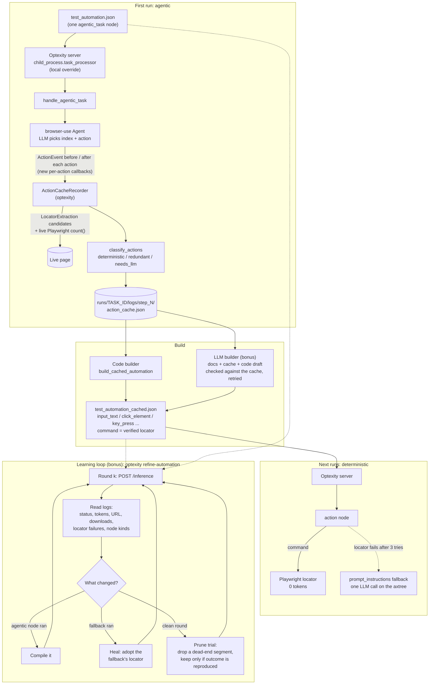
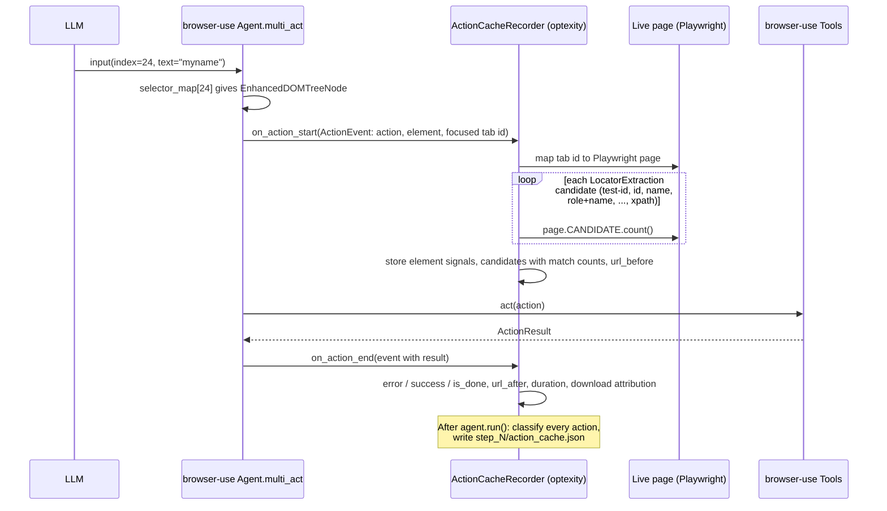
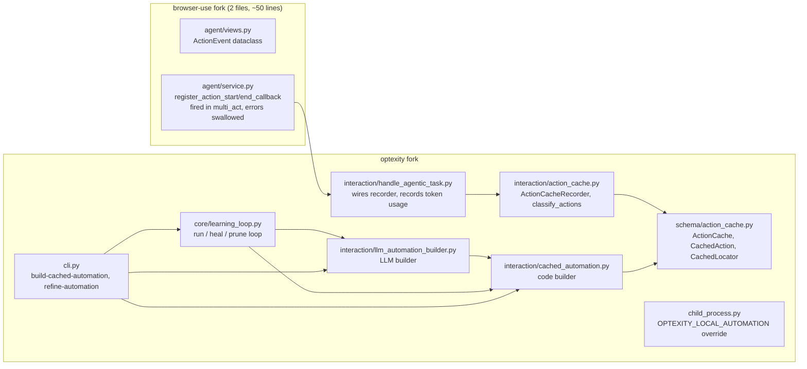

# Action Memory for Optexity Agentic Tasks

The first time Optexity runs an `agentic_task`, browser-use works out each step with the LLM. This project records what the agent did, turns every useful step into a deterministic Playwright locator, and compiles a new automation that replays the run with **zero LLM tokens** and in a fraction of the time. An optional learning loop then reruns, heals, and prunes that automation automatically.

| Site | Agentic run (LLM) | Cached automation | Tokens |
|---|---|---|---|
| Roboform form fill | 20.7 s, 18,103 tokens | 8.2–8.8 s | **0** |
| World Bank: search, country page, indicator, CSV download | 52.8–69.3 s, 71k–104k tokens | 14.4 s (pruned by the loop: 13.0 s) | **0** |

Times are "steps done": seconds from task start until the last automation node finished. That excludes Optexity's final screenshot and S3 uploads, which vary with the network and are the same for both kinds of run.

---

## Contents

1. [The problem](#1-the-problem)
2. [Architecture](#2-architecture)
3. [What was built, step by step](#3-what-was-built-step-by-step)
4. [Results](#4-results)
5. [How to run](#5-how-to-run)
6. [Code map](#6-code-map)

---

## 1. The problem

browser-use turns the page into an indexed text tree (`[67]<a id=dlbtn />`). Each step, the LLM picks an index and an action. Every run starts from nothing: the same form gets filled through the same LLM reasoning, paying the same tokens and latency each time.

Most steps in a workflow are deterministic (type a name into this field, click that link). They don't need an LLM once we know *which element* the agent used. The catch is that the index `[67]` is meaningless on the next run, because indexes come from a fresh DOM serialisation each time. So the memory layer has to:

1. Capture, at the moment of each action, the real DOM element behind the index.
2. Turn that element into a Playwright locator that will find the same element next time, and prove the locator is unique on the live page.
3. Separate useful steps from redundant ones (failed attempts, scrolls, waits, values overwritten later, the final `done` report).
4. Emit an Optexity automation (`action_node`s with `command` + `prompt_instructions`) that replays the useful steps, keeping Optexity's LLM fallback as a safety net if a locator ever breaks.

---

## 2. Architecture

### 2.1 Overview



### 2.2 What happens during one recorded action



### 2.3 Where the code lives

The browser-use fork gets a tiny, generic change: two optional per-action callbacks. Everything Optexity-specific (locators, classification, building, the loop) lives in the Optexity fork.



---

## 3. What was built, step by step

### Step 0: Setup and local override

- Both forks are cloned and installed editable into one venv. `browser-use/` is on the **`optexity` branch** of `Optexity/browser-use` (`optexity-browser-use` 0.9.5.4), not the fork's `main`, which is plain upstream browser-use without Optexity's patches.
- The assignment's `test_automation.json` override lives in `task_processor` in `child_process.py`, as `apply_local_automation_override`. It runs **only when `OPTEXITY_LOCAL_AUTOMATION` is set**, so the normal server path is unchanged. When it is set, it:
  - loads and validates the automation file;
  - merges the file's declared `input_parameters` in as defaults (Optexity otherwise ignores declared values and only substitutes the request's);
  - writes artifacts to `./runs/<task_id>/` instead of `/tmp`, so runs are easy to inspect and the loop can read them.

### Step 1: Baseline agentic run (workstream 01)

Ran the assignment's roboform `agentic_task` and recorded the baseline: 2 agent steps, 2 LLM calls, 18,103 tokens, 20.7 s to finish the steps. The agent batched all four `input`s into step 1; step 2 was a pure "verify and `done`" LLM call.

To measure this, `handle_agentic_task` now copies browser-use's `history.usage` into Optexity's `memory.token_usage`. Before, the history was discarded and the task reported no tokens.

### Step 2: The action cache (workstream 02)

**Where to hook.** In browser-use, `Agent.multi_act` is the only place where each action runs with the page live *and* its index still resolvable through the cached `selector_map` to an `EnhancedDOMTreeNode` (attributes, accessibility role and name, xpath, frame). browser-use's existing hooks (`on_step_start` / `on_step_end`) are per step, not per action, and its history stores no accessibility name and no URL after the action. So the fork gained:

- `ActionEvent` (`agent/views.py`): step, action index, the action model, the resolved DOM element, the focused tab's CDP `target_id`, and (on end) the `ActionResult`.
- `register_action_start_callback` / `register_action_end_callback` on `Agent`, fired around `tools.act(...)`. A failing callback is logged and swallowed, so recording can never break the agent.

**Recording** (`ActionCacheRecorder`, Optexity side):

- **Before the action**, while the element is still on the page, it builds every locator candidate with Optexity's existing `LocatorExtraction._scored_candidates` (test-id > id > name > aria-label > role+name > placeholder > css > text > xpath, dynamic-looking values dropped). It then runs `page.<candidate>.count()` on the live page for each one. That uses the same `eval(f"page.{command}")` path the replay will use, so "unique now" means "will resolve the same way at replay".
- It maps browser-use's focused CDP target to the right Playwright page. Optexity's own `get_current_page` returns the last-opened tab, which isn't necessarily the one the agent is acting on.
- **After the action** it records error, success, `is_done`, extracted content, `url_after`, and duration.
- **Downloads.** A download often lands *after* its click returns. So at the start of each action, and at save, the recorder checks whether new downloads appeared and marks the previous action `started_download`. It counts the same channels Optexity's download handler watches.

**Classification** (`classify_actions`, run on save):

| Category | Rule |
|---|---|
| `redundant` | Failed actions; the `done` report; exploratory actions with no lasting page effect (`scroll`, `wait`, `find_text`, `screenshot`, file tools...); an `input`/`select`/`upload` overwritten by a later one on the same element; `navigate` to the page already open |
| `deterministic` | Element action with a live-verified unique locator; fixed-parameter actions (`navigate`, `search`, `go_back`, `send_keys`) |
| `needs_llm` | Element action with no unique locator (replayed via `prompt_instructions`); `extract`; tab `switch`/`close` (tab ids change per run); anything else without a mapping |

The cache is written per agentic node to `runs/<task_id>/logs/step_<n>/action_cache.json`. Its format is the Pydantic models in `schema/action_cache.py`.

### Step 3: The cached automation (workstream 03)

`optexity build-cached-automation` compiles each top-level `agentic_task` node from its `step_<i>/action_cache.json`:

- Redundant actions are dropped. Each remaining action becomes an Optexity interaction: `input` → `input_text`, `click` → `click_element` (with `expect_download` if it started a download), `select_dropdown` → `select_option`, `upload_file`, `navigate`/`search` → `go_to_url`, `go_back`, and `send_keys` → `key_press`.
- `command` is the **best live-verified unique locator, taken verbatim from the cache**. Nothing is hand-written. `prompt_instructions` is generated from the strongest signal the cache has: accessible name, then placeholder, aria-label, title, name or id, then text.
- An element action with no unique locator gets no `command`. Optexity then resolves it with **one** LLM call on the accessibility tree instead of a full agent loop.
- Replay tuning: `max_tries` 3 instead of 10 (a live-verified locator that fails rarely recovers by retrying, and 10 tries cost about 11 s), and `end_sleep_time` 0 for actions that didn't change the URL.
- **Conservative fallback.** If the agent didn't report success, or any action has no safe deterministic mapping, the whole node stays an `agentic_task`. A half-compiled node could leave the page in a state the rest of the flow doesn't expect.
- The result is re-validated against the `Automation` model before it's written.

Verified on roboform (`test_automation_cached.json`): every node succeeded on try 1 from its locator, with 0 tokens, across several runs. With one locator broken on purpose (`test_automation_cached_broken.json`), the fallback found the right field with one LLM call (about 2.8k tokens) and the form was still filled correctly.

### Step 4: Multi-step site, World Bank (workstream 04)

Task (`test_automation_worldbank.json`): on data.worldbank.org, search for India, open the India country page, open "GDP (current US$)", and download the CSV. It's a real site with several page changes, a search box, and a file download, and it needs no login.

This exposed the download case, which led to the `started_download` attribution described above and to `expect_download` / `expected_downloads` in the builder. The cached automation (`test_automation_worldbank_cached.json`, 6 nodes) replays end to end with 0 tokens and the zip lands in `runs/<task>/downloads/`. Here the locators are proper `get_by_role("link", name="GDP (current US$)")`-style locators, not xpaths.

### Step 5 (bonus): LLM builder

`optexity build-cached-automation --llm` (and `refine-automation --builder llm`) gives the LLM:

- six relevant pages of the Optexity docs (automation structure, interaction actions, parameters, locators, downloads, timing and retries);
- the agent's goal;
- the recorded actions with their verified locators;
- the code builder's draft as a reference.

It returns replacement nodes plus any `input_parameters` it chose to extract.

The LLM may only use what the run actually saw. Every answer must pass Pydantic validation **and** these code checks:

- every `command` is a locator the cache verified unique;
- every typed or selected value, URL, file, and key was actually used by the agent;
- every `{name[0]}` placeholder is declared, and every declared parameter is used;
- the number of `expect_download` clicks equals the downloads the run started.

A rejected answer is sent back with the errors, up to 3 attempts. If every attempt fails, the node stays agentic. The one creative freedom it has is turning typed values into `input_parameters`, which default to the recorded values.

Verified on both sites: each build passed every check on the first attempt (about 16–17k tokens, paid once at build time), and each replay used 0 tokens. On roboform it extracted `full_name`, `address_line_one`, `address_line_2` and `city`; on World Bank it extracted `country`.

### Step 6 (bonus): Learning loop

`optexity refine-automation` drives the local server over `POST /inference`. Each round writes the current automation to the file `OPTEXITY_LOCAL_AUTOMATION` points at, runs it, reads the logs, and derives the next automation:

1. **Compile**: any `agentic_task` node that ran is compiled from that round's action cache (code or LLM builder).
2. **Heal**: a node whose `command` failed and was rescued by the `prompt_instructions` fallback takes the locator the fallback used, so the next round needs no LLM. Verified live on roboform with a deliberately broken locator (see [Results](#4-results)).
3. **Prune**: once a round is clean (succeeded and every node replayed from its locator), try removing one segment of dead-end exploration. The trial must reproduce the same final URL and downloads with no locator failures, or the segment is restored and never tried again.
   - Candidates are only same-page actions on a page the run later leaves, never a download and never anything on the final page. Those are the only places the outcome signals (final URL, download count) can detect breakage.
   - A rejected segment is retried as shorter prefixes, longest first.
   - Trial rounds run with `skip_prompt`, so a bad prune fails in seconds at zero tokens instead of paying for LLM fallbacks.

The loop stops when a round changes nothing. Every round's automation, the per-round metrics (`rounds.json`), and `final.json` are saved under `--out-dir`.

---

## 4. Results

### Roboform

| Run | Steps done | Task | Tokens |
|---|---|---|---|
| Agentic baseline (`52fc849d`, 2 agent steps) | 20.7 s | 29.9 s | 18,103 |
| Agentic rerun (`2e0129ed`, 7 agent steps, filled the form twice) | 42.5 s | 52.5 s | 32,532 |
| Cached (`8ceecab4`, untuned) | 8.8 s | 24.3 s | 0 |
| Cached, tuned (3 runs) | 8.2–9.0 s | 15.3–16.4 s | 0 |
| Cached with one broken locator, tuned (`d5f47e1c`) | 14.5 s | — | 2,795 (one fallback call) |

Most of the cached run's ~8.5 s is browser start and the first page load (about 5 s) plus Optexity's periodic trajectory upload (about 1.8 s). The four fields themselves take about 0.5 s each.

### World Bank

| Run | Steps done | Task | Tokens |
|---|---|---|---|
| Agentic (`a2f13894`, 14 agent steps) | 69.3 s | 93.6 s | 104,272 |
| Agentic (`d4f9029f`, 9 agent steps) | 52.8 s | 82.9 s | 71,101 |
| Cached (`7a1d7c0c`, 6 nodes) | 14.4 s | 31.8 s | 0 |
| LLM-built, replayed (`9606337a`) | 14.0 s | 27.9 s | 0 |
| Loop-pruned (`cfc55c0f`, 5 nodes) | **13.0 s** | 31.7 s | 0 |

### Learning loop on World Bank (live)

| Round | Result | Tokens | Steps done | Change |
|---|---|---|---|---|
| compile 1 | success (agent) | 83,693 | 65.4 s | 1 agentic node compiled into 10 nodes |
| compile 2 | success | 0 | 24.8 s | trial: prune 7 home-page nodes |
| compile 3 | failed | 92,300 | 76.3 s | reverted; fallbacks ran (this led to the fail-fast trials) |
| prune 1 | success | 0 | 23.2 s | trial: prune 7 |
| prune 2–3 | 3 locator failures | 0 | ~22 s | reverted; trial 6, then 5 |
| prune 4 | success, 1 download | 0 | **13.0 s** | **kept** (5 nodes) |
| prune 5–6 | 3 locator failures | 0 | ~21–22 s | reverted; stop |

Final automation (`test_automation_worldbank_pruned.json`): type "India" in "Search economy", press Enter, click "Economy profile", click "GDP (current US$)", click "CSV" (download).

Stability: the 5-node automation was rerun 3 more times (`e14dc916`, `7b1ebf33`, `a8863b13`; `examples/action_cache/loop/worldbank_pruned_rerun_*`). All 3 succeeded with 0 tokens, every node from its locator, steps done in 13.7 s, 14.5 s and 17.3 s. Each ended on the GDP (current US$) indicator page for India and downloaded `API_NY.GDP.MKTP.CD_DS2_en_csv_v2_*.zip`, which contains the GDP (current US$) dataset with India's row.

### Learning loop healing a broken locator (live, roboform)

Started from `test_automation_cached_broken.json`, where node 1's locator points at a non-existent `div[99]` (`examples/action_cache/loop/roboform_heal/`):

| Round | Task | Result | Tokens | Steps done | Change |
|---|---|---|---|---|---|
| 1 | `7b3f14c8` | success; node 1 fell back to the LLM | 2,799 | 15.1 s | healed node 1 to `...div[8]/div[2]/input`, the same locator the original run recorded |
| 2 | `7b38290d` | success; all 4 nodes from their locators, all fields correct | **0** | 9.1 s | none, so the loop stops |

---

## 5. How to run

Prerequisites: this repo and the [browser-use fork](https://github.com/Ashutosh-codes/browser-use) (`optexity` branch) installed editable in one venv, and a `.env` with the LLM key and Optexity settings. Paths below are relative to the directory you start the server from; runs are written to `./runs/<task_id>/`.

```bash
# 0. Offline: rebuild a shipped example from its recorded cache (no server, browser or LLM)
optexity build-cached-automation \
  --automation examples/action_cache/automations/test_automation.json \
  --logs-directory examples/action_cache/action_caches/roboform_3a415351 \
  -o /tmp/test_automation_cached.json
pytest tests    # the offline test suite

# 1. Point the server at a local automation and start it (in a normal terminal)
echo 'OPTEXITY_LOCAL_AUTOMATION=test_automation.json' >> .env
ENV_PATH=.env optexity inference --port 9000

# 2. Trigger it (endpoint_name of any automation on your account; its input_parameters keys must match)
curl -X POST localhost:9000/inference \
  -H 'Content-Type: application/json' \
  -d '{"endpoint_name": "<endpoint>", "input_parameters": {}}'
#    Artifacts: runs/<task_id>/logs/step_0/action_cache.json, state.json, screenshots

# 3. Compile the cached automation from that run
ENV_PATH=.env optexity build-cached-automation \
  --automation test_automation.json \
  --logs-directory runs/<task_id>/logs \
  -o test_automation_cached.json
#    add --llm [--model <litellm model>] for the LLM builder

# 4. Replay it: set OPTEXITY_LOCAL_AUTOMATION=test_automation_cached.json, restart the server, trigger again

# 5. Or let the loop do 2-4 (and heal and prune) automatically
#    (server's OPTEXITY_LOCAL_AUTOMATION must be runs/loop/current.json, the default --live-path)
ENV_PATH=.env optexity refine-automation \
  --automation test_automation_worldbank.json \
  --endpoint <endpoint> \
  --out-dir runs/loop/worldbank \
  --rounds 10            # --builder llm to compile with the LLM
```

### Shipped examples (`examples/action_cache/`)

A curated subset of the recorded runs, enough to rerun every builder offline and trace every number above. Screenshots, accessibility trees, conversations and full logs are not included; the task IDs identify them.

`automations/`

| File | What it is |
|---|---|
| `test_automation.json` | Roboform agentic task (from the assignment) |
| `test_automation_cached.json` | Roboform, compiled by the code builder |
| `test_automation_cached_broken.json` | The same with one locator broken on purpose (fallback and healing tests) |
| `test_automation_llm.json` | Roboform, compiled by the LLM builder (with extracted `input_parameters`) |
| `test_automation_worldbank.json` | World Bank agentic task |
| `test_automation_worldbank_cached.json` | World Bank, compiled by the code builder (6 nodes) |
| `test_automation_worldbank_llm.json` | World Bank, compiled by the LLM builder |
| `test_automation_worldbank_pruned.json` | World Bank after the learning loop (5 nodes) |

`action_caches/<name>/step_0/action_cache.json` (pass `action_caches/<name>` as `--logs-directory`)

| Folder | Run |
|---|---|
| `roboform_3a415351` | Clean roboform run: 4 deterministic inputs and `done`. Source of `test_automation_cached.json` |
| `roboform_refilled_2e0129ed` | The agent filled the form twice; the first fill is classified as overwritten, so it compiles to the same automation |
| `worldbank_d4f9029f` | Source of `test_automation_worldbank_cached.json`, with the CSV click flagged as a download |
| `worldbank_exploratory_a2f13894` | 15 actions including dead-end exploration on the home page (6 redundant) |

`loop/`: `round_<k>.json`, `rounds.json` (per-round metrics) and `final.json` for the World Bank compile run (`worldbank/`), the prune run (`worldbank_prune/`) and the live healing run (`roboform_heal/`), plus `rounds.json` of the three stability reruns (`worldbank_pruned_rerun_<k>/`).

---

## 6. Code map

**browser-use fork** ([Ashutosh-codes/browser-use](https://github.com/Ashutosh-codes/browser-use), branch based on `optexity`)

- `browser_use/agent/views.py`: `ActionEvent`
- `browser_use/agent/service.py`: `register_action_start_callback` / `register_action_end_callback`, fired in `multi_act` via `_fire_action_callback`

**optexity fork** (this repo, under `optexity/`)

- `schema/action_cache.py`: cache format (`ActionCache`, `CachedAction`, `CachedElement`, `CachedLocator`)
- `inference/core/interaction/action_cache.py`: `ActionCacheRecorder` (live locator verification, tab mapping, download attribution) and `classify_actions`
- `inference/core/interaction/handle_agentic_task.py`: attaches the recorder to the agent, saves the cache, records token usage
- `inference/core/interaction/cached_automation.py`: code builder (`build_cached_automation`, `compile_action_cache`)
- `inference/core/interaction/llm_automation_builder.py`: LLM builder and its cache checks
- `inference/core/learning_loop.py`: compile / heal / prune loop
- `cli.py`: `build-cached-automation`, `refine-automation`
- `inference/child_process.py`: `apply_local_automation_override`

**Tests** (`tests/`, offline: no browser, LLM or network; run with `pytest tests`)

- `test_action_cache.py`: classification rules; the recorder pairing start and end callbacks and attributing late downloads
- `test_cached_automation.py`: action-to-node mapping, verbatim locators, replay tuning, conservative fallbacks
- `test_llm_automation_builder.py`: every cache check that rejects invented locators, values, parameters or downloads; retry-with-errors and keep-agentic paths, with a scripted fake LLM
- `test_learning_loop.py`: prune candidate selection and prefix retries, trial acceptance, reading the fallback's locator for healing, fail-fast trial copies
